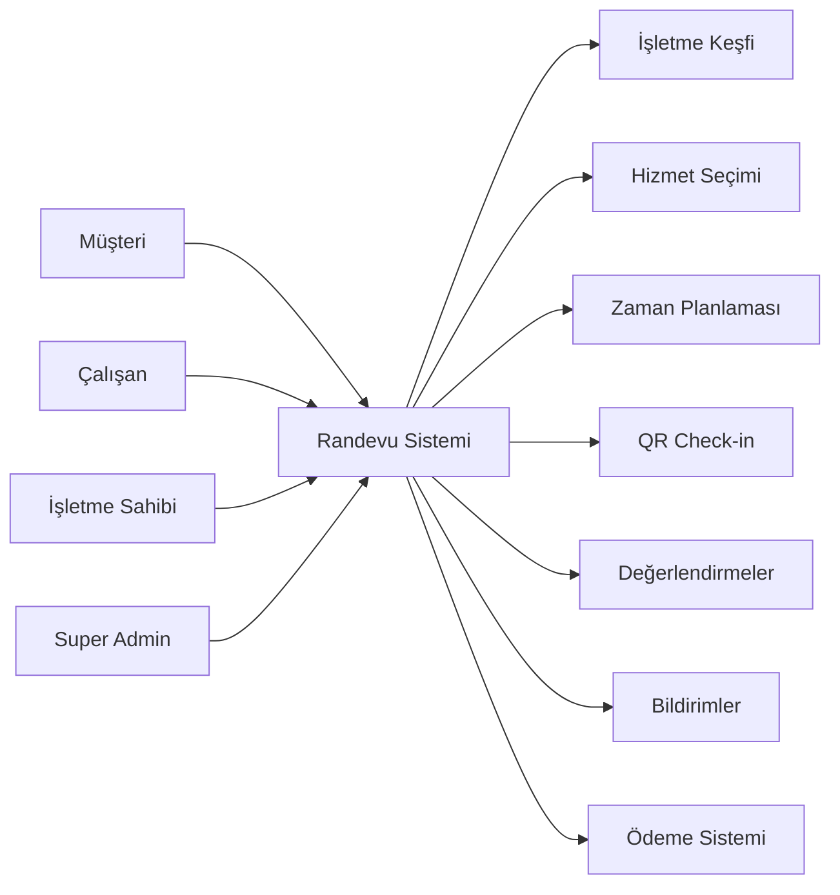
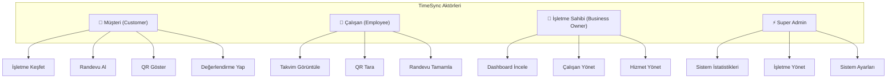
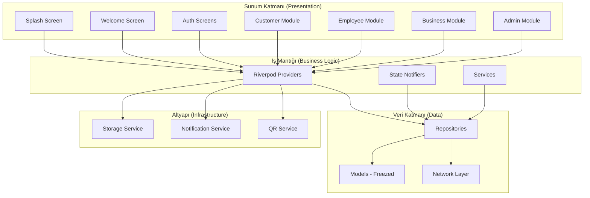
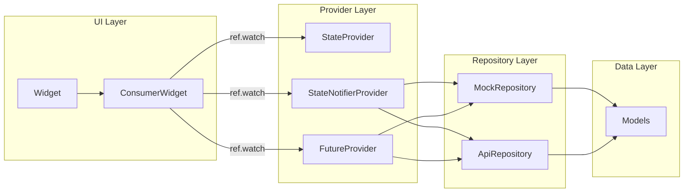
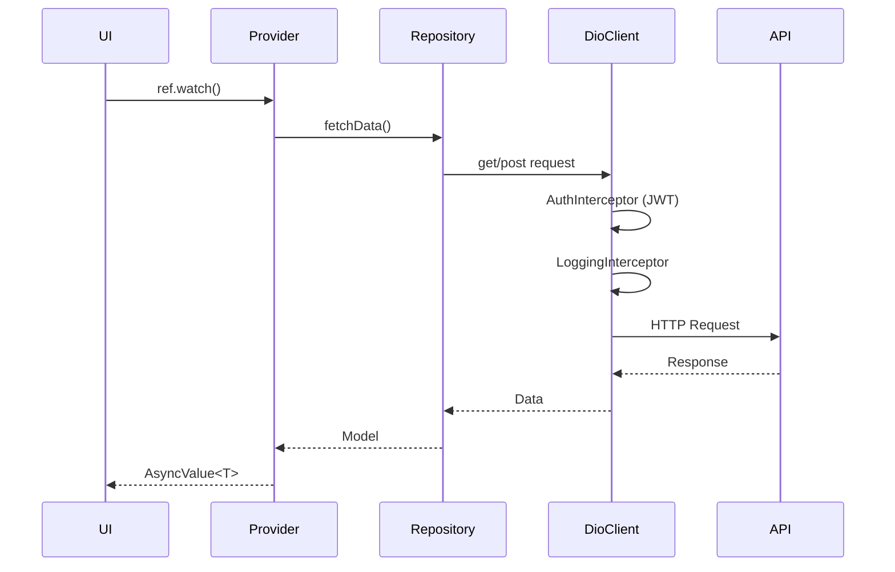
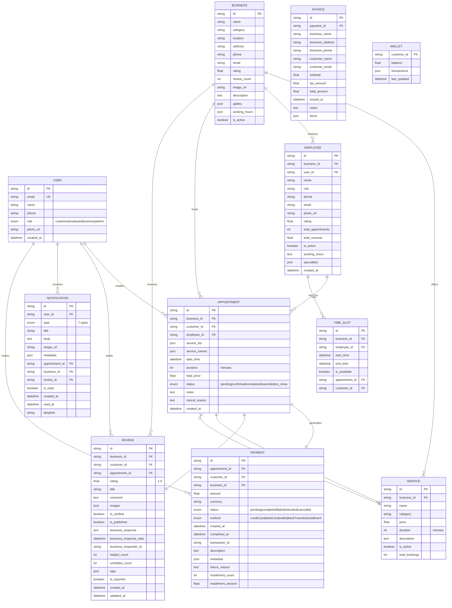

 # TimeSync - Sistem Analizi ve Tasarımı Dokümanı

**Belge Versiyonu:** 1.0  
**Tarih:** 21 Aralık 2025  
**Proje Durumu:** Faz 1-9 Tamamlandı (Production Ready aşamasına hazır)

---

## 📋 İçindekiler

1. [Proje Amacı ve Kapsamı](#1-proje-amacı-ve-kapsamı)
2. [Sistem Kısıtları](#2-sistem-kısıtları)
3. [Aktörler (Kullanıcı Rolleri)](#3-aktörler-kullanıcı-rolleri)
4. [Fonksiyonel Gereksinimler](#4-fonksiyonel-gereksinimler)
5. [Fonksiyonel Olmayan Gereksinimler](#5-fonksiyonel-olmayan-gereksinimler)
6. [Sistem Mimarisi](#6-sistem-mimarisi)
7. [Teknoloji Yığını (Technology Stack)](#7-teknoloji-yığını)
8. [Veritabanı Şeması](#8-veritabanı-şeması)

---

## 1. Proje Amacı ve Kapsamı

### 1.1 Proje Amacı

**TimeSync**, modern işletmeler ve müşterileri arasında **randevu yönetimini** kolaylaştıran, mobil öncelikli bir randevu ve iş yönetim platformudur.

#### Ana Hedefler

| Hedef | Açıklama |
|-------|----------|
| **Randevu Kolaylığı** | Müşterilerin kolayca işletme keşfetmesi, hizmet seçmesi ve randevu alması |
| **Çalışan Verimliliği** | Çalışanların gün içi programlarını görüntülemesi, QR check-in ile hızlı işlem yapması |
| **İşletme Analizi** | İşletme sahiplerinin gelir, çalışan performansı ve müşteri memnuniyetini takip etmesi |
| **Merkezi Yönetim** | Super Admin'lerin tüm sistemi tek noktadan yönetmesi |

### 1.2 Proje Kapsamı



---

## 2. Sistem Kısıtları

### 2.1 Teknik Kısıtlar

| Kısıt | Detay |
|-------|-------|
| **Platform** | Android (API 21+), iOS (12.0+), Web |
| **Minimum SDK** | Dart 3.0.0 - 4.0.0 |
| **Flutter** | 3.x stabil sürüm |
| **Backend** | Şu an Mock API, Production için REST API hazır |
| **Depolama** | Hassas veriler `flutter_secure_storage`, genel ayarlar `SharedPreferences` |

### 2.2 İş Kısıtları

| Kısıt | Açıklama |
|-------|----------|
| **Çalışma Saatleri** | Randevular işletme çalışma saatleri içinde alınabilir |
| **İptal Politikası** | Randevular belirli süre öncesine kadar iptal edilebilir |
| **Check-in Penceresi** | QR kod 30 dakika önce - 15 dakika sonra arası geçerli |
| **QR Güvenliği** | HMAC SHA-256 ile 24 saat geçerli imza |

### 2.3 Performans Kısıtları

| Metrik | Hedef Değer |
|--------|-------------|
| İlk yükleme süresi | < 3 saniye |
| Sayfa geçişleri | < 200 ms |
| API yanıt süresi | < 500 ms |
| Binary boyutu | ~ 45 MB (release) |

---

## 3. Aktörler (Kullanıcı Rolleri)

### 3.1 Rol Tanımları



### 3.2 Müşteri (Customer)

| Özellik | Açıklama |
|---------|----------|
| **Rol Kodu** | `UserRole.customer` |
| **Ana Ekranlar** | Keşfet, Randevularım, Profil |
| **Navigasyon** | 3 sekme alt menü |

**Yetenekler:**
- İşletme arama ve filtreleme
- Hizmet seçimi (çoklu seçim destekli)
- Çalışan ve zaman dilimi seçimi
- Randevu oluşturma, görüntüleme, iptal etme
- QR kod ile check-in
- İşletme değerlendirme ve yorum yapma
- Bildirim alma ve yönetme

### 3.3 Çalışan (Employee)

| Özellik | Açıklama |
|---------|----------|
| **Rol Kodu** | `UserRole.employee` |
| **Ana Ekranlar** | Ana Sayfa, Takvim, Profil |
| **Navigasyon** | 3 sekme alt menü |

**Yetenekler:**
- Günlük/haftalık takvim görüntüleme
- QR kod tarama ile müşteri check-in
- Randevu durumu güncelleme (tamamla, iptal)
- Kendi performans istatistiklerini görme
- Bildirim alma

### 3.4 İşletme Sahibi (Business Owner)

| Özellik | Açıklama |
|---------|----------|
| **Rol Kodu** | `UserRole.business` |
| **Ana Ekranlar** | Dashboard, Çalışanlar, Hizmetler, Ayarlar |
| **Navigasyon** | 4 sekme alt menü |

**Yetenekler:**
- Gelir takibi (günlük, haftalık, aylık)
- Çalışan ekleme, düzenleme, aktif/pasif yapma
- Hizmet CRUD işlemleri
- İşletme bilgisi ve çalışma saatleri düzenleme
- Müşteri yorumlarına yanıt verme
- Performans raporları görüntüleme

### 3.5 Super Admin

| Özellik | Açıklama |
|---------|----------|
| **Rol Kodu** | `UserRole.admin` |
| **Ana Ekranlar** | Dashboard, İşletmeler, Ayarlar |
| **Navigasyon** | 3 sekme alt menü |

**Yetenekler:**
- Sistem geneli istatistikler
- Tüm işletmeleri yönetme
- İşletme onaylama/askıya alma
- Sistem bakım modu
- Güvenlik ayarları

---

## 4. Fonksiyonel Gereksinimler

### 4.1 Kimlik Doğrulama Modülü (FR-AUTH)

| ID | Gereksinim | Öncelik |
|----|------------|---------|
| FR-AUTH-01 | Kullanıcı e-posta ve şifre ile kayıt olabilmeli | Yüksek |
| FR-AUTH-02 | Kullanıcı e-posta ve şifre ile giriş yapabilmeli | Yüksek |
| FR-AUTH-03 | Kullanıcı kayıt sırasında rol seçebilmeli | Yüksek |
| FR-AUTH-04 | JWT token ile oturum yönetimi yapılmalı | Yüksek |
| FR-AUTH-05 | Token'lar güvenli depolama ile saklanmalı | Yüksek |
| FR-AUTH-06 | Kullanıcı çıkış yapabilmeli | Orta |

### 4.2 İşletme Keşif Modülü (FR-DISC)

| ID | Gereksinim | Öncelik |
|----|------------|---------|
| FR-DISC-01 | Müşteri işletmeleri listeleyebilmeli | Yüksek |
| FR-DISC-02 | İşletme adına göre arama yapabilmeli | Yüksek |
| FR-DISC-03 | Kategoriye göre filtreleme yapabilmeli | Orta |
| FR-DISC-04 | İşletme detay sayfası görüntüleyebilmeli | Yüksek |
| FR-DISC-05 | Infinite scroll ile sayfalama yapılmalı | Orta |
| FR-DISC-06 | 500ms debounce ile arama | Düşük |

### 4.3 Randevu Modülü (FR-APPT)

| ID | Gereksinim | Öncelik |
|----|------------|---------|
| FR-APPT-01 | Müşteri çoklu hizmet seçebilmeli | Yüksek |
| FR-APPT-02 | Toplam fiyat ve süre hesaplanmalı | Yüksek |
| FR-APPT-03 | Müsait çalışan listesi gösterilmeli | Yüksek |
| FR-APPT-04 | 14 günlük takvim seçimi sunulmalı | Yüksek |
| FR-APPT-05 | Müsait zaman dilimleri gösterilmeli | Yüksek |
| FR-APPT-06 | Randevu onay özeti sunulmalı | Orta |
| FR-APPT-07 | Randevu oluşturulduktan sonra listeye eklenmeli | Yüksek |
| FR-APPT-08 | Randevu iptal edilebilmeli | Orta |
| FR-APPT-09 | Yaklaşan/geçmiş randevular ayrı gösterilmeli | Orta |

### 4.4 QR Kod Modülü (FR-QR)

| ID | Gereksinim | Öncelik |
|----|------------|---------|
| FR-QR-01 | Müşteri randevusu için QR kod oluşturabilmeli | Yüksek |
| FR-QR-02 | QR kod HMAC SHA-256 ile imzalanmalı | Yüksek |
| FR-QR-03 | QR kod 24 saat geçerli olmalı | Orta |
| FR-QR-04 | Çalışan QR tarayabilmeli | Yüksek |
| FR-QR-05 | Check-in penceresi kontrolü yapılmalı | Orta |
| FR-QR-06 | Tarama sonucu başarı/hata gösterilmeli | Orta |

### 4.5 Bildirim Modülü (FR-NOTIF)

| ID | Gereksinim | Öncelik |
|----|------------|---------|
| FR-NOTIF-01 | Firebase FCM entegrasyonu | Yüksek |
| FR-NOTIF-02 | 7 farklı bildirim tipi desteklenmeli | Orta |
| FR-NOTIF-03 | Okunmamış bildirim sayacı | Orta |
| FR-NOTIF-04 | Bildirim merkezi ekranı | Orta |
| FR-NOTIF-05 | Yerel bildirimler (flutter_local_notifications) | Orta |
| FR-NOTIF-06 | Konu bazlı abonelik (topic) | Düşük |

### 4.6 Değerlendirme Modülü (FR-REV)

| ID | Gereksinim | Öncelik |
|----|------------|---------|
| FR-REV-01 | 5 yıldızlı değerlendirme sistemi | Yüksek |
| FR-REV-02 | Başlık ve yorum alanı | Yüksek |
| FR-REV-03 | Fotoğraf yükleme desteği | Orta |
| FR-REV-04 | İşletme yanıt verebilmeli | Orta |
| FR-REV-05 | Helpful/unhelpful oylama | Düşük |
| FR-REV-06 | Uygunsuz yorum raporlama | Düşük |
| FR-REV-07 | Verified purchase badge | Orta |
| FR-REV-08 | Rating dağılımı grafiği | Düşük |

### 4.7 İşletme Yönetim Modülü (FR-BIZ)

| ID | Gereksinim | Öncelik |
|----|------------|---------|
| FR-BIZ-01 | Gelir dashboard'u (günlük/haftalık/aylık) | Yüksek |
| FR-BIZ-02 | Trend göstergeleri (yüzde değişim) | Orta |
| FR-BIZ-03 | Çalışan listesi ve yönetimi | Yüksek |
| FR-BIZ-04 | Çalışan aktif/pasif toggle | Orta |
| FR-BIZ-05 | Hizmet CRUD işlemleri | Yüksek |
| FR-BIZ-06 | İşletme bilgi düzenleme | Orta |
| FR-BIZ-07 | Çalışma saatleri ayarlama | Orta |

### 4.8 Admin Modülü (FR-ADMIN)

| ID | Gereksinim | Öncelik |
|----|------------|---------|
| FR-ADMIN-01 | Sistem geneli istatistikler | Yüksek |
| FR-ADMIN-02 | Toplam işletme, kullanıcı, gelir | Yüksek |
| FR-ADMIN-03 | İşletme listesi ve filtreleme | Orta |
| FR-ADMIN-04 | İşletme onay/askıya alma | Orta |
| FR-ADMIN-05 | Sistem bakım modu | Düşük |
| FR-ADMIN-06 | Güvenlik ayarları | Düşük |

---

## 5. Fonksiyonel Olmayan Gereksinimler

### 5.1 Performans (NFR-PERF)

| ID | Gereksinim | Hedef Değer |
|----|------------|-------------|
| NFR-PERF-01 | Uygulama başlatma süresi | < 3 saniye |
| NFR-PERF-02 | Sayfa geçiş animasyonu | < 200 ms |
| NFR-PERF-03 | API yanıt işleme | < 500 ms |
| NFR-PERF-04 | Liste renderı (lazy loading) | 60 FPS |

### 5.2 Güvenlik (NFR-SEC)

| ID | Gereksinim | Uygulama |
|----|------------|----------|
| NFR-SEC-01 | JWT token güvenli depolama | `flutter_secure_storage` |
| NFR-SEC-02 | API anahtarı şifreleme | Envied ile obfuscation |
| NFR-SEC-03 | QR kod imzalama | HMAC SHA-256 |
| NFR-SEC-04 | Network güvenliği | Dio interceptors |
| NFR-SEC-05 | Hassas veri şifreleme | AES encryption desteği |

### 5.3 Kullanılabilirlik (NFR-USE)

| ID | Gereksinim | Uygulama |
|----|------------|----------|
| NFR-USE-01 | Türkçe arayüz | Varsayılan dil |
| NFR-USE-02 | Koyu/açık tema desteği | Toggle ile geçiş |
| NFR-USE-03 | Material Design 3 uyumu | Google Fonts, MD3 widgets |
| NFR-USE-04 | Shimmer loading effects | Skeleton ekranlar |
| NFR-USE-05 | Staggered animasyonlar | Liste animasyonları |

### 5.4 Güvenilirlik (NFR-REL)

| ID | Gereksinim | Uygulama |
|----|------------|----------|
| NFR-REL-01 | Hata işleme | AsyncValue pattern |
| NFR-REL-02 | Retry mekanizması | Pull-to-refresh |
| NFR-REL-03 | Offline desteği | SharedPreferences cache |
| NFR-REL-04 | Crash protection | Firebase resilience |

### 5.5 Bakım Kolaylığı (NFR-MAINT)

| ID | Gereksinim | Uygulama |
|----|------------|----------|
| NFR-MAINT-01 | Modüler yapı | Feature-based architecture |
| NFR-MAINT-02 | Kod üretimi | Freezed + json_serializable |
| NFR-MAINT-03 | State yönetimi | Riverpod (tek standart) |
| NFR-MAINT-04 | Lint kuralları | flutter_lints |

---

## 6. Sistem Mimarisi

### 6.1 Üst Düzey Mimari



### 6.2 Dizin Yapısı

```
lib/
├── main.dart                 # Uygulama giriş noktası
│
├── core/                     # Çekirdek altyapı
│   ├── animations/           # Animasyon yardımcıları
│   ├── config/               # Uygulama konfigürasyonları
│   ├── constants/            # Sabitler (renkler, stiller)
│   ├── navigation/           # Navigasyon yardımcıları
│   ├── network/              # Dio HTTP client, interceptors
│   ├── providers/            # Riverpod providers (rol bazlı)
│   ├── repositories/         # Repository arayüzleri
│   ├── services/             # Servisler (QR, Storage)
│   ├── storage/              # Depolama servisleri
│   ├── theme/                # Tema tanımları
│   └── widgets/              # Ortak widget'lar
│
├── data/                     # Veri katmanı
│   ├── models/               # Freezed data models (9 adet)
│   ├── network/              # API repository implementasyonları
│   └── repositories/         # Mock repository'ler
│
└── presentation/             # Sunum katmanı
    ├── admin/                # Super Admin ekranları (3)
    ├── auth/                 # Kimlik doğrulama (2)
    ├── business/             # İşletme sahibi (4)
    ├── common/               # Ortak ekranlar
    ├── customer/             # Müşteri modülü (10)
    ├── employee/             # Çalışan modülü (4)
    ├── navigation/           # Navigasyon wrapper'ları (4)
    ├── splash/               # Başlangıç ekranı
    └── welcome/              # Karşılama ekranı
```

### 6.3 State Management Mimarisi



### 6.4 Network Layer



---

## 7. Teknoloji Yığını

### 7.1 Frontend (Mobile)

| Kategori | Teknoloji | Versiyon | Açıklama |
|----------|-----------|----------|----------|
| **Framework** | Flutter | 3.x | Cross-platform mobil geliştirme |
| **Dil** | Dart | >= 3.0.0 | Tip güvenli programlama dili |
| **State Management** | Riverpod | 2.4.9 | Reaktif state yönetimi |
| **Navigation** | go_router | 13.0.0 | Deklaratif routing |

### 7.2 UI & Design

| Paket | Versiyon | Kullanım |
|-------|----------|----------|
| google_fonts | 6.1.0 | Typography (Plus Jakarta Sans, Spline Sans) |
| flutter_svg | 2.0.9 | SVG görseller |
| cached_network_image | 3.3.0 | Image caching |
| shimmer | 3.0.0 | Loading skeleton efektleri |

### 7.3 Data & Network

| Paket | Versiyon | Kullanım |
|-------|----------|----------|
| dio | 5.4.0 | HTTP client |
| freezed_annotation | 2.4.1 | Immutable data classes |
| json_annotation | 4.8.1 | JSON serialization |
| freezed | 2.4.7 | Code generation (dev) |
| json_serializable | 6.7.1 | JSON generation (dev) |
| build_runner | 2.4.8 | Kod üretici (dev) |

### 7.4 Storage

| Paket | Versiyon | Kullanım |
|-------|----------|----------|
| shared_preferences | 2.2.2 | Genel ayarlar, tema |
| flutter_secure_storage | 9.0.0 | JWT, hassas veriler |

### 7.5 Features

| Paket | Versiyon | Kullanım |
|-------|----------|----------|
| qr_flutter | 4.1.0 | QR kod oluşturma |
| mobile_scanner | 3.5.5 | QR kod tarama |
| crypto | 3.0.7 | HMAC SHA-256 imzalama |
| firebase_core | 4.3.0 | Firebase SDK |
| firebase_messaging | 16.1.0 | Push notifications |
| flutter_local_notifications | 19.5.0 | Yerel bildirimler |

### 7.6 Utilities

| Paket | Versiyon | Kullanım |
|-------|----------|----------|
| intl | 0.18.1 | Tarih/saat formatlaması |
| uuid | 4.2.2 | Benzersiz ID üretimi |
| envied | 0.5.4+1 | Environment değişkenleri |

### 7.7 Development Tools

| Araç | Kullanım |
|------|----------|
| flutter_lints | Kod kalitesi kuralları |
| flutter_launcher_icons | App icon üretimi |
| flutter_native_splash | Splash screen yapılandırması |
| envied_generator | Env değişken üretimi |

---

## 8. Veritabanı Şeması

### 8.1 Entity Relationship Diagram



### 8.2 Tablo Detayları

#### 8.2.1 users Tablosu

| Kolon | Tip | Kısıtlar | Açıklama |
|-------|-----|----------|----------|
| id | VARCHAR(36) | PK | UUID formatında benzersiz ID |
| email | VARCHAR(255) | UNIQUE, NOT NULL | E-posta adresi |
| name | VARCHAR(100) | NOT NULL | Tam ad |
| phone | VARCHAR(20) | NULL | Telefon numarası |
| role | ENUM | NOT NULL | customer, employee, business, admin |
| photo_url | VARCHAR(500) | NULL | Profil fotoğrafı URL |
| created_at | TIMESTAMP | DEFAULT NOW | Kayıt tarihi |

#### 8.2.2 businesses Tablosu

| Kolon | Tip | Kısıtlar | Açıklama |
|-------|-----|----------|----------|
| id | VARCHAR(36) | PK | UUID formatında |
| name | VARCHAR(200) | NOT NULL | İşletme adı |
| category | VARCHAR(50) | NOT NULL | Kategori |
| location | VARCHAR(100) | NOT NULL | Konum/semt |
| address | TEXT | NOT NULL | Tam adres |
| phone | VARCHAR(20) | NOT NULL | İletişim telefonu |
| email | VARCHAR(255) | NOT NULL | İşletme e-postası |
| rating | DECIMAL(2,1) | DEFAULT 0 | Ortalama puan (0-5) |
| review_count | INT | DEFAULT 0 | Toplam yorum sayısı |
| image_url | VARCHAR(500) | NOT NULL | Kapak fotoğrafı |
| description | TEXT | NULL | İşletme açıklaması |
| gallery | JSON | NULL | Galeri fotoğrafları listesi |
| working_hours | JSON | NULL | Çalışma saatleri {"Pazartesi": "09:00-18:00"} |
| is_active | BOOLEAN | DEFAULT TRUE | Aktif/pasif durumu |

#### 8.2.3 services Tablosu

| Kolon | Tip | Kısıtlar | Açıklama |
|-------|-----|----------|----------|
| id | VARCHAR(36) | PK | UUID formatında |
| business_id | VARCHAR(36) | FK → businesses | İşletme referansı |
| name | VARCHAR(100) | NOT NULL | Hizmet adı |
| category | VARCHAR(50) | NOT NULL | Hizmet kategorisi |
| price | DECIMAL(10,2) | NOT NULL | Fiyat (TL) |
| duration | INT | NOT NULL | Süre (dakika) |
| description | TEXT | NULL | Hizmet açıklaması |
| is_active | BOOLEAN | DEFAULT TRUE | Aktif/pasif |
| total_bookings | INT | DEFAULT 0 | Toplam rezervasyon |

#### 8.2.4 employees Tablosu

| Kolon | Tip | Kısıtlar | Açıklama |
|-------|-----|----------|----------|
| id | VARCHAR(36) | PK | UUID formatında |
| business_id | VARCHAR(36) | FK → businesses | İşletme referansı |
| user_id | VARCHAR(36) | FK → users | Kullanıcı hesabı |
| name | VARCHAR(100) | NOT NULL | Çalışan adı |
| role | VARCHAR(50) | NOT NULL | Pozisyon/görev |
| phone | VARCHAR(20) | NOT NULL | Telefon |
| email | VARCHAR(255) | NOT NULL | E-posta |
| photo_url | VARCHAR(500) | NULL | Profil fotoğrafı |
| rating | DECIMAL(2,1) | DEFAULT 0 | Çalışan puanı |
| total_appointments | INT | DEFAULT 0 | Toplam randevu |
| total_revenue | DECIMAL(12,2) | DEFAULT 0 | Toplam gelir |
| is_active | BOOLEAN | DEFAULT TRUE | Aktif/pasif |
| working_hours | TEXT | NULL | Çalışma saatleri |
| specialties | JSON | NULL | Uzmanlık alanları listesi |
| created_at | TIMESTAMP | DEFAULT NOW | Kayıt tarihi |

#### 8.2.5 appointments Tablosu

| Kolon | Tip | Kısıtlar | Açıklama |
|-------|-----|----------|----------|
| id | VARCHAR(36) | PK | UUID formatında |
| business_id | VARCHAR(36) | FK → businesses | İşletme |
| customer_id | VARCHAR(36) | FK → users | Müşteri |
| employee_id | VARCHAR(36) | FK → employees | Atanan çalışan |
| service_ids | JSON | NOT NULL | Seçilen hizmet ID'leri |
| service_names | JSON | NOT NULL | Hizmet adları |
| date_time | TIMESTAMP | NOT NULL | Randevu tarihi/saati |
| duration | INT | NOT NULL | Toplam süre (dakika) |
| total_price | DECIMAL(10,2) | NOT NULL | Toplam tutar |
| status | ENUM | NOT NULL | pending, confirmed, completed, cancelled, no_show |
| notes | TEXT | NULL | Müşteri notu |
| cancel_reason | TEXT | NULL | İptal nedeni |
| created_at | TIMESTAMP | DEFAULT NOW | Oluşturulma tarihi |

#### 8.2.6 reviews Tablosu

| Kolon | Tip | Kısıtlar | Açıklama |
|-------|-----|----------|----------|
| id | VARCHAR(36) | PK | UUID formatında |
| business_id | VARCHAR(36) | FK → businesses | İşletme |
| customer_id | VARCHAR(36) | FK → users | Yorumlayan müşteri |
| appointment_id | VARCHAR(36) | FK → appointments | İlgili randevu |
| rating | DECIMAL(2,1) | NOT NULL | Puan (1.0 - 5.0) |
| title | VARCHAR(200) | NOT NULL | Yorum başlığı |
| comment | TEXT | NOT NULL | Yorum içeriği |
| images | JSON | NULL | Eklenen fotoğraflar |
| is_verified | BOOLEAN | DEFAULT FALSE | Doğrulanmış satın alma |
| is_published | BOOLEAN | DEFAULT TRUE | Yayında/gizli |
| business_response | TEXT | NULL | İşletme yanıtı |
| business_response_date | TIMESTAMP | NULL | Yanıt tarihi |
| business_responder_id | VARCHAR(36) | NULL | Yanıtlayan ID |
| helpful_count | INT | DEFAULT 0 | Faydalı oy sayısı |
| unhelpful_count | INT | DEFAULT 0 | Faydasız oy sayısı |
| tags | JSON | NULL | Etiketler |
| is_reported | BOOLEAN | DEFAULT FALSE | Rapor edildi mi |
| created_at | TIMESTAMP | DEFAULT NOW | Oluşturulma |
| updated_at | TIMESTAMP | NULL | Güncelleme |

#### 8.2.7 notifications Tablosu

| Kolon | Tip | Kısıtlar | Açıklama |
|-------|-----|----------|----------|
| id | VARCHAR(36) | PK | UUID formatında |
| user_id | VARCHAR(36) | FK → users | Alıcı kullanıcı |
| type | ENUM | NOT NULL | 7 bildirim tipi |
| title | VARCHAR(200) | NOT NULL | Bildirim başlığı |
| body | TEXT | NOT NULL | Bildirim içeriği |
| image_url | VARCHAR(500) | NULL | Görsel URL |
| metadata | JSON | NULL | Ek veriler |
| appointment_id | VARCHAR(36) | NULL | İlgili randevu |
| business_id | VARCHAR(36) | NULL | İlgili işletme |
| review_id | VARCHAR(36) | NULL | İlgili yorum |
| is_read | BOOLEAN | DEFAULT FALSE | Okundu mu |
| created_at | TIMESTAMP | DEFAULT NOW | Gönderilme tarihi |
| read_at | TIMESTAMP | NULL | Okunma tarihi |
| deeplink | VARCHAR(500) | NULL | Uygulama yönlendirmesi |

**Notification Types:**
- `appointmentConfirmed` - Randevu onaylandı
- `appointmentReminder` - Randevu hatırlatması
- `appointmentCancelled` - Randevu iptal edildi
- `appointmentRescheduled` - Randevu değiştirildi
- `newReview` - Yeni yorum
- `businessUpdate` - İşletme güncellemesi
- `systemNotification` - Sistem bildirimi

#### 8.2.8 time_slots Tablosu

| Kolon | Tip | Kısıtlar | Açıklama |
|-------|-----|----------|----------|
| id | VARCHAR(36) | PK | UUID formatında |
| business_id | VARCHAR(36) | FK → businesses | İşletme |
| employee_id | VARCHAR(36) | FK → employees | Çalışan |
| start_time | TIMESTAMP | NOT NULL | Başlangıç zamanı |
| end_time | TIMESTAMP | NOT NULL | Bitiş zamanı |
| is_available | BOOLEAN | DEFAULT TRUE | Müsait mi |
| appointment_id | VARCHAR(36) | NULL | Dolu ise randevu ID |
| customer_id | VARCHAR(36) | NULL | Dolu ise müşteri ID |

#### 8.2.9 payments Tablosu

| Kolon | Tip | Kısıtlar | Açıklama |
|-------|-----|----------|----------|
| id | VARCHAR(36) | PK | UUID formatında |
| appointment_id | VARCHAR(36) | FK → appointments | İlgili randevu |
| customer_id | VARCHAR(36) | FK → users | Ödeyen |
| business_id | VARCHAR(36) | FK → businesses | Alıcı işletme |
| amount | DECIMAL(10,2) | NOT NULL | Tutar |
| currency | VARCHAR(3) | DEFAULT 'TRY' | Para birimi |
| status | ENUM | NOT NULL | pending, completed, failed, refunded, cancelled |
| method | ENUM | NOT NULL | creditCard, debitCard, wallet, bankTransfer, installment |
| created_at | TIMESTAMP | DEFAULT NOW | Oluşturulma |
| completed_at | TIMESTAMP | NULL | Tamamlanma |
| transaction_id | VARCHAR(100) | NULL | Ödeme sağlayıcı TX ID |
| description | TEXT | NULL | Açıklama |
| metadata | JSON | NULL | Ek veriler |
| failure_reason | TEXT | NULL | Başarısızlık nedeni |
| installment_count | INT | NULL | Taksit sayısı |
| installment_amount | DECIMAL(10,2) | NULL | Taksit tutarı |

#### 8.2.10 invoices Tablosu

| Kolon | Tip | Kısıtlar | Açıklama |
|-------|-----|----------|----------|
| id | VARCHAR(36) | PK | UUID formatında |
| payment_id | VARCHAR(36) | FK → payments | İlgili ödeme |
| business_name | VARCHAR(200) | NOT NULL | İşletme adı |
| business_address | TEXT | NOT NULL | İşletme adresi |
| business_phone | VARCHAR(20) | NOT NULL | İşletme telefonu |
| customer_name | VARCHAR(100) | NOT NULL | Müşteri adı |
| customer_email | VARCHAR(255) | NOT NULL | Müşteri e-posta |
| subtotal | DECIMAL(10,2) | NOT NULL | Ara toplam |
| tax_amount | DECIMAL(10,2) | NOT NULL | KDV tutarı |
| total_amount | DECIMAL(10,2) | NOT NULL | Genel toplam |
| issued_at | TIMESTAMP | DEFAULT NOW | Düzenlenme tarihi |
| notes | TEXT | NULL | Notlar |
| items | JSON | NULL | Fatura kalemleri |

#### 8.2.11 wallets Tablosu

| Kolon | Tip | Kısıtlar | Açıklama |
|-------|-----|----------|----------|
| customer_id | VARCHAR(36) | PK, FK → users | Cüzdan sahibi |
| balance | DECIMAL(12,2) | DEFAULT 0 | Bakiye |
| transactions | JSON | NULL | İşlem geçmişi |
| last_updated | TIMESTAMP | DEFAULT NOW | Son güncelleme |

### 8.3 İndeksler

```sql
-- Performance indexes
CREATE INDEX idx_appointments_customer ON appointments(customer_id);
CREATE INDEX idx_appointments_business ON appointments(business_id);
CREATE INDEX idx_appointments_employee ON appointments(employee_id);
CREATE INDEX idx_appointments_datetime ON appointments(date_time);
CREATE INDEX idx_appointments_status ON appointments(status);

CREATE INDEX idx_reviews_business ON reviews(business_id);
CREATE INDEX idx_reviews_customer ON reviews(customer_id);
CREATE INDEX idx_reviews_rating ON reviews(rating);

CREATE INDEX idx_notifications_user ON notifications(user_id);
CREATE INDEX idx_notifications_read ON notifications(is_read);

CREATE INDEX idx_services_business ON services(business_id);
CREATE INDEX idx_employees_business ON employees(business_id);

CREATE INDEX idx_time_slots_employee ON time_slots(employee_id);
CREATE INDEX idx_time_slots_available ON time_slots(is_available);

CREATE INDEX idx_payments_appointment ON payments(appointment_id);
CREATE INDEX idx_payments_status ON payments(status);
```

---

## Sonuç

Bu doküman, **TimeSync** mobil randevu yönetim sisteminin tam kapsamlı sistem analizi ve tasarımını içermektedir. Proje şu anda Faz 1-9 tamamlanmış durumdadır ve production aşamasına hazırlanmaktadır.

### Önemli Notlar

- **Mock API**: Sistem şu anda mock veri ile çalışmaktadır, backend entegrasyonu hazırdır
- **Güvenlik**: JWT, SecureStorage, HMAC SHA-256 ile güvenlik altyapısı kurulmuştur
- **State Management**: Tüm sistemde Riverpod standart olarak kullanılmaktadır
- **Kod Kalitesi**: Freezed ile immutable veri modelleri, lint kuralları uygulanmaktadır

---

**Hazırlayan:** TimeSync Development Team  
**Tarih:** 21 Aralık 2025  
**Belge Versiyonu:** 1.0
